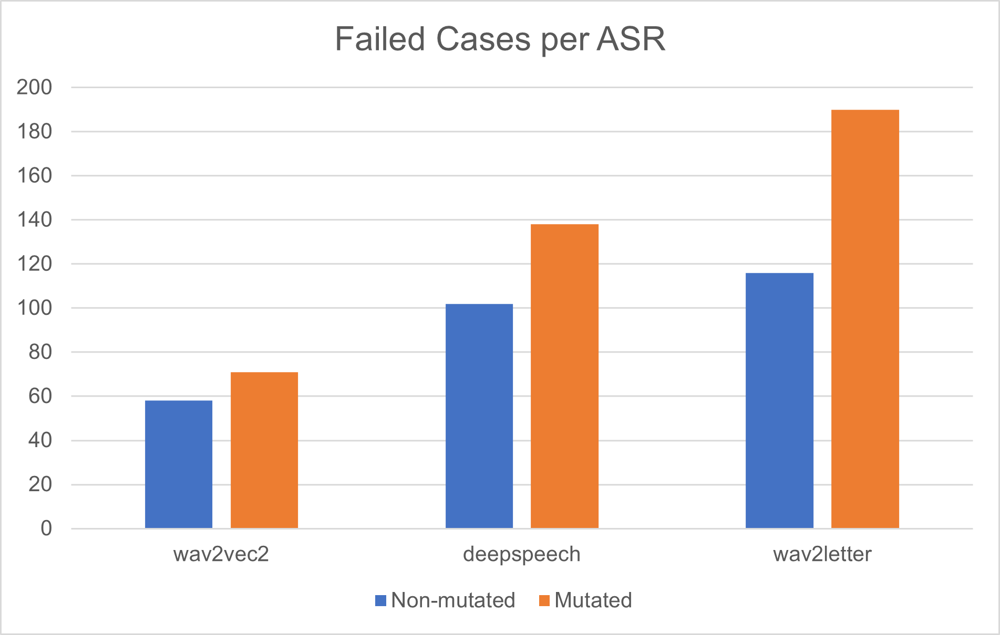
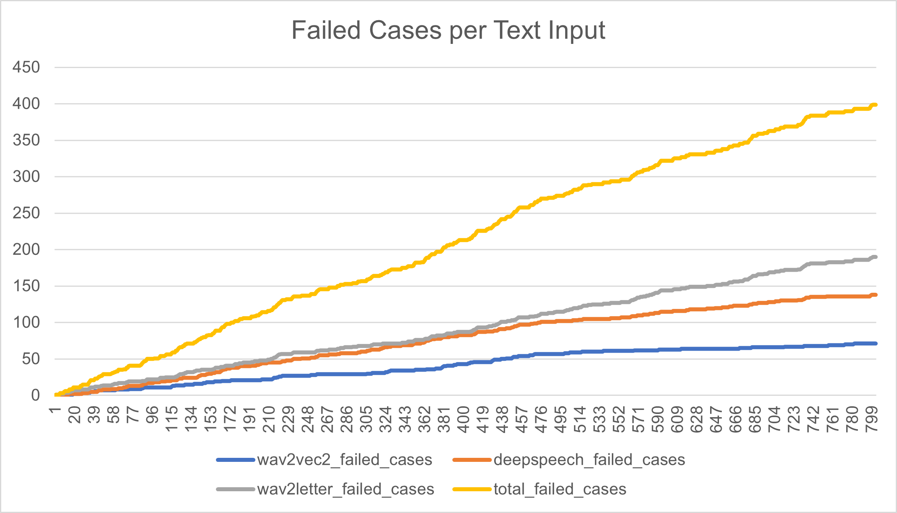

# ASDF: A Differential Testing Framework for ASR Systems

Automatic testing tools for Automatic Speech Recognition (ASR) systems are used to uncover failed test cases using  ASDF is a differential testing framework for ASR systems. ASDF leverages upon [CrossASR++](https://github.com/soarsmu/CrossASRplus), an existing ASR testing tool that automates the audio test case generation process, and further improves it by incorporating differential testing methods. CrossASR++ selects texts from an input text corpus, converts them into audio using a Text-to-Speech (TTS) service, and uses the audio to test the ASR systems. However, the quality of these tests greatly depend on the quality of the text corpus provided, and may not uncover underlying weaknesses of the ASRs due to the text's limited variation and vocabulary. 

Here, ASDF builds upon CrossASR++ by incoprporating differential testing for ASR systems by applying text transformation methods to the original text inputs that failed in the CrossASR++ ASR testing process, effectively creating new high-quality test cases for ASR systems. The text transformation methods used are homophone transformation, augmentation, plurality transformation, tense transformation and adjacent deletion. We also improved analysis by providing high-level summaries of failed test cases and a graph of phonemes in the text input against their frequency of failure. Finally, we improved the tool's usability by including a CLI for easier use. 

Please check out our (Tool Demonstration video)[] and (PDF preprint)[].

## Initial Setup

### WSL
1. Set up WSL to use Linux in Windows. [Guide](https://docs.microsoft.com/en-us/windows/wsl/install)
2. To access Window files in WSL: WSL mounts your machine's fixed drives under the /mnt/<drive> folder in your Linux distros. For example, your C: drive is mounted under /mnt/c/
3. It is recommended to store your local repo under your Linux distro home directory instead of /mnt/<drive>/... because differing file naming systems will cause issues (eg. filename is not case sensitive in Windows file system)
4. To connect to the Internet, change the `nameserver` in `etc/resolv.conf` to 8.8.8.8. [Stackoverflow](https://stackoverflow.com/questions/62314789/no-internet-connection-on-wsl-ubuntu-windows-subsystem-for-linux)
5. `etc/resolv.conf` will reset everytime you restart WSL. To solve this issue, look at this [post](https://askubuntu.com/questions/1347712/make-etc-resolv-conf-changes-permanent-in-wsl-2)

### Docker Desktop
1. Download [Docker Desktop](https://www.docker.com/products/docker-desktop/)
2. If you are using WSL, set up Docker Desktop for Windows with WSL 2. [Guide](https://docs.microsoft.com/en-us/windows/wsl/tutorials/wsl-containers)

## Usage
1. Go to the `example` directory using: `cd asdf-differential-testing/CrossASRplus/examples`
2. Execute the `start.bat` batch file
3. Follow the prompts to customise execution

For certain selections, the default settings are used if not specified by the user:
- Input corpus file path: `CrossASRplus/examples/corpus/50-europarl-20000.txt`
- Output file path: `CrossASRplus/examples/output/default`
- ASRs: `deepspeech`, `wav2letter`, `wav2vec`
- Number of texts to be processed: 100

## Results
Once testing is compeleted, a folder containing the results can be found within the `output` directory named as specified by user input. If none is specified, it is defaulted to `CrossASRplus/examples/output/default`.

Four folders are created within this directory:
1. `case`: Contains nested folders of the format `<tts_name>/<asr_name>/<test_case_no>.txt` containing text files indicating the result of each test case for each individual ASR. `0` indicates an indeterminable test case, `1` indicates a failed test case and `2` indicates a successful test case.
2. `data`: Contains two nested folders of the format `audio/<tts_name>` and `transcription/<tts_name>/<asr_name>` which holds the audio files produced from the TTS and transcriptions of the audio by each individual ASR respectively.
3. `execution_time`: Contains two nested folders of the format `audio/<tts_name>` and `transcription/<tts_name>/<asr_name>/<test_case_no>` which contains text files indicating the time taken to produce each test case's audio and transcription by each ASR respectively.
4. `result`: Contains a nested folder of the format `<tts_name>/<asr_name_1_asr_name_2_...asr_name_n>/num_iteration_2/text_batch_size_global` which contains six files:
    1. `all_test_cases.json`: JSON file which has a key for each iteration containing an array value detailing the outcome of each text input.
    2. `indeterminable.json`: JSON file detailing the statistics of indeterminable test cases.
    3. `without_estimator.json`: JSON file detailing the statistics of failed test cases.
    4. `failed_test_cases_analysis.txt`: TXT file detailing the statistics of failed test cases.
    5. `phoneme_graph.pdf`: PDF file graphing each phoneme within the processed text corpus and its respective frequency of failure.
    6. `asr_comparison.csv`: CSV file containing two different tables for self-analysis, failed cases per ASR and failed cases per text input.

## Example Analysis
Some of the analysis that can be done by graphing the data in the CSV file are as follows:

